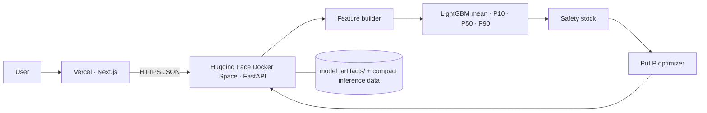

# SmartStock AI — demand forecasting, safety stock and inventory placement

An end-to-end decision-support system: **LightGBM** forecasts SKU × store demand with P10/P50/P90 uncertainty → **safety-stock** logic → **PuLP** placement optimizer → **FastAPI** (Docker, Hugging Face Space) → **Next.js** dashboard (Vercel).

> **Data note.** The pipeline reads the **M5 Forecasting – Accuracy** file format. This repo ships with a *synthetic M5-format* generator so everything runs offline; every number below comes from that synthetic data. Re-run on the real M5 files (see below) before quoting results anywhere. Lead times, costs, current stock, supply and capacity are **simulated** in either case.



## Repository layout
```
training/   notebooks/ (01-09)  scripts/ (make_synthetic_m5, prepare_data, train, evaluate, simulate_business, export_artifacts)  requirements.txt
backend/    app/ (main, engine, schemas, routes/, models/{forecasting,inventory,optimizer}, features/feature_builder)  model_artifacts/  Dockerfile  predict_cli.py
frontend/   Next.js 14 + TypeScript + Tailwind + Recharts  (lib/api.ts is the only place that knows the backend URL)
tests/      leakage, optimizer hand-checks, inventory maths, API contract, CORS, artifact parity (22 tests)
sql/        DuckDB analysis (CTEs, window functions)      docs/api.md      .github/workflows/ (CI + HF deploy)
```

## Quick start
```bash
pip install -r training/requirements.txt
make all                         # synthetic data -> train (MLflow) -> backtest -> export artifacts -> tests
python backend/predict_cli.py FOODS_1_001 CA_1      # milestone: SKU/store in, 28-day forecast + recommendation out
make api                         # http://localhost:7860/docs
make frontend                    # http://localhost:3000   (NEXT_PUBLIC_API_URL=http://localhost:7860)
mlflow ui --backend-store-uri sqlite:///training/outputs/mlflow.db
```
**Using real M5:** download `calendar.csv`, `sales_train_validation.csv`, `sell_prices.csv` from Kaggle into `data/raw/m5/`, then
`python training/scripts/prepare_data.py --stores CA_1 CA_2 TX_1 --n-items 100`, `make train simulate export`. Do **not** commit raw data.
Notebooks run on Colab/Kaggle (the first cell clones the repo and installs requirements).

## What was measured (synthetic data, 80 series × 900 days, 4 held-out test origins × 28 days)
| Method | WAPE | MAE | RMSE |
|---|---|---|---|
| Naive (last day) | 101.3% | 2.24 | 3.56 |
| Moving avg 7 | 77.0% | 1.70 | 2.56 |
| Moving avg 28 (best baseline) | 74.7% | 1.65 | 2.46 |
| Seasonal naive | 93.9% | 2.08 | 3.23 |
| **LightGBM** | **71.2%** | **1.58** | **2.34** |

* LightGBM: 4.7% lower WAPE than the best baseline. The synthetic series are very noisy (negative-binomial), which caps achievable accuracy.
* **P90 coverage 89.7%** (nominal 90%); P10–P90 band covers 86.2% (nominal 80%). The P10 is usually 0 on count data, so judge calibration on P50/P90.
* **Inventory back-test** (112 days of actual demand, weekly review, lost sales, 95% target) vs a textbook MA+z·σ safety-stock rule: total cost **−9.4%**, fill rate **+0.7 pts**, average stock **−10.8%** (similar at 90% / 98% targets; full tables in `backend/model_artifacts/business_simulation.json`). These depend on the simulated cost parameters.

## Design decisions worth knowing
* **One model, direct multi-horizon.** A single global LightGBM predicts day `origin+h` from features known at the origin (+ horizon `h`), so there is no recursive error build-up and serving is a single batch predict. Features live in `backend/app/features/feature_builder.py` and are imported by both training and the API; `tests/test_features.py` proves that corrupting data *after* the origin does not change any feature.
* **Chronological splits only**: train origins → validation origins → untouched test origins; hyper-parameters chosen on validation.
* **Parity is enforced**: `export_artifacts.py` fails unless the compact inference bundle reproduces the full-panel forecasts (max abs diff recorded in `parity_check.json`; currently 0).
* **Total-demand P90** is computed from aggregated variance, not by summing daily P90s (which would overstate risk several-fold).
* **Optimizer** also lets overstocked stores release units (cost = transport), so recommendations can say REDUCE, not only INCREASE. Solved as an integer program with CBC; hand-checkable cases are unit-tested.
* **Honest stress test**: in `/simulate` the demand shock is a *surprise* unless "planners know in advance" is ticked; a leaner policy can lose fill rate in a surprise spike.

## Deploy
**Backend → Hugging Face Docker Space**
1. Create a Space, SDK **Docker**. `backend/README.md` already contains the required front-matter (`sdk: docker`, `app_port: 7860`).
2. Push the *contents of `backend/`* to the Space repo (or let `.github/workflows/deploy-backend-hf.yml` do it: secret `HF_TOKEN`, variable `HF_SPACE=user/space-name`).
3. Space → Settings → Variables: `ALLOWED_ORIGINS=https://<your-app>.vercel.app` (optional `ALLOWED_ORIGIN_REGEX` for previews). Open `/docs`, call `/health`, `/recommendation`.

**Frontend → Vercel**
1. Import the GitHub repo, set **Root Directory = `frontend`**.
2. Environment variable `NEXT_PUBLIC_API_URL=https://<user>-<space>.hf.space` (public by design — never put secrets in `NEXT_PUBLIC_*`). Redeploy after changing it.
3. Then add the Vercel domain to the Space's `ALLOWED_ORIGINS`. Free Spaces sleep when idle; the UI shows a "waking up" message after 4 s.

## Verified here vs. still for you to run
| Verified in the build environment | Not possible here — do before shipping |
|---|---|
| Data pipeline + QA assertions, training, quantiles, MLflow logging, backtest, export + parity | `docker build` / `docker run` (no Docker in the sandbox; Dockerfile follows the Hugging Face recipe) |
| 22 pytest tests pass; API served by `uvicorn` on :7860 and exercised over HTTP | Real M5 run and quoting of real metrics |
| All 9 notebooks' code cells execute; SQL queries run in DuckDB | Pushing to Hugging Face / Vercel (needs your accounts) |
| `next build` compiles and type-checks | Visual check of the UI in a browser and mobile widths |

## Resume bullets — fill in after the **real M5** run
* Built a global LightGBM SKU-store demand forecaster (lag/rolling/calendar/price/event features, leakage-tested, chronological validation) that cut WAPE by **[x]%** vs the best baseline; P90 coverage **[y]%**.
* Converted forecast uncertainty into safety stock and a PuLP placement optimizer under supply and capacity limits; back-test on simulated costs showed **[z]%** lower total cost at equal-or-better fill rate.
* Shipped it as a Dockerized FastAPI service (Hugging Face) with a Next.js/Vercel dashboard, MLflow tracking and a train/serve parity check.
